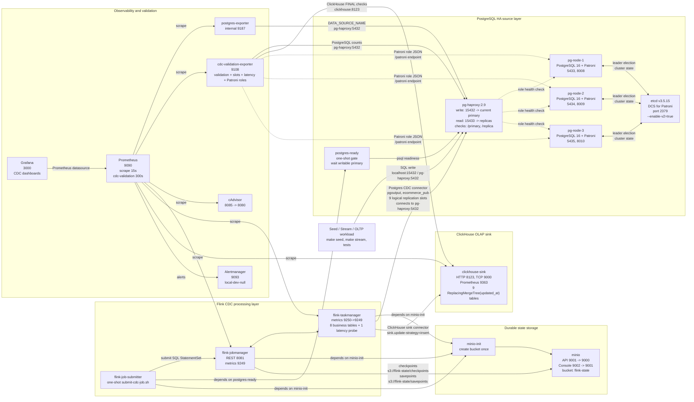

# CDC E-commerce Pipeline: PostgreSQL HA to ClickHouse with Flink CDC

Dự án xây dựng một pipeline CDC end-to-end cho mô hình e-commerce, đồng bộ dữ liệu từ PostgreSQL OLTP sang ClickHouse OLAP bằng Apache Flink CDC. Toàn bộ stack được đóng gói bằng Docker Compose, gồm PostgreSQL HA 3 node với Patroni + etcd, HAProxy role-aware, Flink JobManager/TaskManager, MinIO checkpoint/savepoint storage, ClickHouse sink, Prometheus/Grafana/Alertmanager và bộ script Python để seed dữ liệu, tạo workload realtime, benchmark, failover test và kiểm tra tính nhất quán dữ liệu.

Mục tiêu của dự án là mô phỏng một kiến trúc production-like: bắt thay đổi `INSERT`, `UPDATE`, soft delete trên nhiều bảng nghiệp vụ, ghi sang ClickHouse theo dạng latest state, duy trì state Flink qua S3-compatible storage, kiểm tra tính đúng đắn của dữ liệu sau CDC và cung cấp một workflow vận hành có thể lặp lại.

## Kiến Trúc



### Thành phần chính

| Component | Vai trò |
| --- | --- |
| PostgreSQL 16 + Patroni | Cụm OLTP source 3 node, role primary/replica do Patroni quyết định |
| etcd | Distributed Configuration Store cho Patroni leader election |
| HAProxy | Role-aware PostgreSQL proxy: write tới primary, read tới replicas |
| Flink 1.18 | Runtime xử lý CDC job |
| Flink Postgres CDC connector | Đọc WAL/logical replication từ PostgreSQL |
| Flink ClickHouse connector | Ghi CDC events vào ClickHouse |
| MinIO | S3-compatible storage cho Flink checkpoint/savepoint |
| ClickHouse | OLAP sink, dùng `ReplacingMergeTree(updated_at)` |
| Prometheus/Grafana/Alertmanager | Metrics, dashboard và alert routing cho môi trường local |
| cdc-validation-exporter | Expose validation, replication slot, latency và Patroni role metrics |
| Python scripts | Seed data, tạo realtime workload, validate consistency |

## Data Model

Pipeline hiện đồng bộ 8 bảng e-commerce và 1 bảng probe vận hành để đo latency CDC:

| PostgreSQL source | ClickHouse sink | Nội dung |
| --- | --- | --- |
| `customers` | `customers_sink` | Khách hàng |
| `categories` | `categories_sink` | Danh mục sản phẩm |
| `products` | `products_sink` | Sản phẩm và tồn kho hiện tại |
| `orders` | `orders_sink` | Đơn hàng, doanh thu, trạng thái thanh toán |
| `order_items` | `order_items_sink` | Chi tiết đơn hàng |
| `payments` | `payments_sink` | Giao dịch thanh toán |
| `shipments` | `shipments_sink` | Vận chuyển |
| `inventory_movements` | `inventory_movements_sink` | Lịch sử biến động tồn kho |
| `cdc_latency_probe` | `cdc_latency_probe_sink` | Probe đo độ trễ CDC |

Tất cả bảng source có `created_at`, `updated_at`, `deleted_at`. Dự án dùng soft delete thông qua `deleted_at` để phù hợp với CDC/OLAP và vẫn giữ được trạng thái lịch sử khi đối chiếu dữ liệu.

Timestamp trong Flink và ClickHouse được cấu hình ở precision microsecond:

```sql
TIMESTAMP(6)
DateTime64(6)
```

Lý do: các bảng ClickHouse dùng `ReplacingMergeTree(updated_at)`. Nếu nhiều update xảy ra trong cùng một millisecond, version precision thấp có thể làm ClickHouse giữ nhầm phiên bản. Microsecond precision giúp quá trình chọn latest state ổn định hơn.

## Cấu Trúc Repository

```text
.
|-- clickhouse/
|   |-- init.sql                         # ClickHouse sink schema
|   `-- config.d/                        # ClickHouse Prometheus config
|-- flink/
|   |-- Dockerfile                       # Flink image kèm connector jars
|   |-- connectors/                      # Postgres CDC + ClickHouse connectors
|   |-- jobs/postgres_to_clickhouse.sql  # Flink SQL CDC job
|   `-- submit-cdc-job.sh                # One-shot job submitter
|-- haproxy/
|   `-- haproxy.cfg                      # Role-aware Postgres routing
|-- monitoring/
|   |-- alertmanager/                    # Alertmanager local config
|   |-- cdc-validation-exporter/         # Exporter image wrapper
|   |-- grafana/                         # Provisioned dashboards/datasource
|   `-- prometheus/                      # Scrape config and alert rules
|-- postgres-ha/
|   |-- patroni/                         # Patroni image, entrypoint, template
|   |-- primary-init/                    # PostgreSQL schema, publication, replica identity
|   `-- replica-init/                    # Legacy/compat init area
|-- scripts/
|   |-- benchmark/                       # Latency, large-load, stress-stream benchmark
|   |-- common/                          # Shared script utilities
|   |-- database/                        # Database connection helpers
|   |-- monitoring/                      # Validation exporter implementation
|   |-- seeders/                         # Seed dữ liệu ban đầu
|   |-- services/                        # Business write/update logic
|   |-- streams/                         # Fake realtime workload
|   `-- validation/                      # Readiness, consistency, recovery, failover tests
|-- docker-compose.yml
|-- Makefile
`-- docs/
```

## Yêu Cầu

- Docker Engine
- Docker Compose v2
- Python 3.10+ khuyến nghị
- Python packages cho host-side scripts:
  - `psycopg2`
  - `faker`
  - `tqdm`

Thiết lập virtualenv:

```bash
python3 -m venv venv
source venv/bin/activate
pip install psycopg2-binary faker tqdm
```

## Cấu Hình

Host-side Python scripts đọc cấu hình PostgreSQL và ClickHouse từ environment variables. Giá trị mặc định đã phù hợp với Docker Compose local.

Có thể tạo file `.env` từ mẫu:

```bash
cp .env.example .env
```

Default endpoints:

| Service | Host port | Mục đích |
| --- | ---: | --- |
| etcd | `2379` | DCS cho Patroni |
| PostgreSQL HA node 1 | `5433`, `8008` | PostgreSQL/Patroni REST |
| PostgreSQL HA node 2 | `5434`, `8009` | PostgreSQL/Patroni REST |
| PostgreSQL HA node 3 | `5435`, `8010` | PostgreSQL/Patroni REST |
| HAProxy write/read | `15432`, `15433` | Role-aware PostgreSQL proxy |
| Flink UI | `8081` | Theo dõi CDC job |
| MinIO API | `9001` | S3-compatible checkpoint/savepoint storage |
| MinIO Console | `9002` | Giao diện quản trị MinIO local |
| ClickHouse HTTP | `8123` | Validation/query HTTP |
| ClickHouse native | `9000` | `clickhouse-client` |
| ClickHouse metrics | `9363` | Prometheus native metrics |
| Prometheus | `9090` | Metrics and alert rules |
| Alertmanager | `9093` | Alert routing and local dev receiver |
| Grafana | `3000` | CDC dashboards |
| cAdvisor | `8085` | Container metrics |
| CDC validation exporter | `9108` | Validation metrics |

## Quick Start

### 1. Khởi động toàn bộ stack

```bash
make reset
```

Lệnh này sẽ:

- Xóa containers và volumes cũ.
- Build Flink image kèm connector.
- Start PostgreSQL HA nodes, HAProxy, MinIO, ClickHouse, Flink và monitoring stack.
- Submit Flink CDC SQL job.
- Chạy readiness check.

Kết quả mong đợi:

```text
CDC stack is ready for seed traffic.
```

Nếu không muốn xóa volume, dùng:

```bash
make up
```

### 2. Seed dữ liệu ban đầu

```bash
make seed
```

Default seed:

| Table | Rows |
| --- | ---: |
| customers | 1000 |
| products | 300 |
| orders | 1000 |

Quá trình seed orders sẽ tạo thêm dữ liệu liên quan như `order_items`, `payments` và `inventory_movements` tùy theo business logic.

### 3. Kiểm tra dữ liệu CDC

```bash
make validate
```

Kết quả thành công:

```text
[PASS] table active/deleted counts
[PASS] orders revenue
[PASS] payments total
[PASS] product stock total
[PASS] shipment status counts
[PASS] inventory movement type counts
[PASS] inventory movement quantity
[PASS] orphan foreign keys
[PASS] updated row counts

9/9 PASS

Validation passed: PostgreSQL and ClickHouse are consistent.
```

Validation có retry/poll ngắn để tránh fail giả khi CDC còn độ trễ nhỏ.

### 4. Chạy realtime workload

```bash
make stream
```

Script này tạo workload liên tục:

- Thêm/cập nhật customers.
- Thêm/cập nhật products.
- Tạo orders mới.
- Cập nhật payments.
- Tạo/cập nhật shipments.
- Ghi inventory movements.

Dùng `Ctrl+C` để dừng stream.

Nên chạy `make validate` sau khi stream đã chạy một lúc, hoặc tạm dừng stream nếu cần một kết quả validation ổn định tuyệt đối.

### 5. Đo latency CDC

```bash
make latency
```

Lệnh này ghi các probe row vào PostgreSQL, poll ClickHouse cho tới khi row xuất hiện ở `cdc_latency_probe_sink`, rồi in p50/p95/p99/max latency.

### 6. Kiểm thử fault tolerance

```bash
make fault-tolerance
```

Lệnh này restart lần lượt Flink TaskManager, Flink JobManager, ClickHouse và CDC validation exporter, sau đó kiểm tra recovery, active logical replication slots, validation dữ liệu và metrics endpoint.

Các test chuyên biệt hơn:

```bash
make flink-recovery
make pg-failover-test
make idempotency-order-test
```

### 7. Chạy throughput stress test

```bash
make stress-tc1
make stress-tc2
make stress-tc3
make stress-tc4
make stress-tc5
```

Các target này chạy các mốc Version 4 từ 100 đến 5,000 events/phút. Có thể tùy biến:

```bash
make stress-stream STRESS_RATE=1000 STRESS_DURATION=600 STRESS_WARMUP=60
```

## Các Lệnh Kiểm Tra

### Readiness check

```bash
make ready
```

Kiểm tra:

- PostgreSQL có đủ 8 application tables.
- PostgreSQL và ClickHouse có đủ 8 application tables cộng `cdc_latency_probe`.
- Flink CDC job đang `RUNNING`.
- 9 logical replication slots đang active.
- Flink logs không có error marker nghiêm trọng.

### Data consistency check

```bash
make validate
```

Đây là lệnh chính để kết luận pipeline CDC có đồng bộ đúng hay không.

### Full stack verification

```bash
make verify
```

Lệnh này kiểm tra thêm checkpoint progress của Flink. Trong môi trường demo multi-table CDC, checkpoint có thể bị ảnh hưởng bởi source idle hoặc connector behavior. Vì vậy workflow chính để demo correctness là:

```bash
make ready
make validate
```

Nếu `make verify` fail ở checkpoint nhưng `make ready` và `make validate` pass, data path CDC vẫn đang hoạt động đúng.

## Manual Checks

### PostgreSQL shell

```bash
make pg
```

Ví dụ:

```sql
SELECT COUNT(*) FROM orders WHERE deleted_at IS NULL;
SELECT SUM(final_amount) FROM orders WHERE deleted_at IS NULL;
SELECT slot_name, active FROM pg_replication_slots ORDER BY slot_name;
```

### ClickHouse shell

```bash
make ch
```

Ví dụ:

```sql
SELECT count()
FROM ecommerce_ods.orders_sink FINAL;

SELECT sum(final_amount)
FROM ecommerce_ods.orders_sink FINAL
WHERE deleted_at IS NULL;

SELECT shipment_status, count()
FROM ecommerce_ods.shipments_sink FINAL
WHERE deleted_at IS NULL
GROUP BY shipment_status;
```

Dùng `FINAL` khi đối chiếu correctness vì sink tables dùng `ReplacingMergeTree(updated_at)`.

### ClickHouse latest-state và `FINAL`

ClickHouse sink trong dự án này là append/versioned latest-state sink. CDC update từ PostgreSQL tạo thêm version mới trong ClickHouse; `ReplacingMergeTree(updated_at)` dùng `updated_at` để chọn bản mới nhất khi background merge chạy hoặc khi query dùng `FINAL`.

Vì background merge là bất đồng bộ, validation dùng `FINAL` để đọc trạng thái đúng tại thời điểm kiểm tra. `FINAL` có chi phí CPU/RAM cao hơn trên dữ liệu lớn, nên chỉ nên dùng cho correctness query hoặc truy vấn cần độ chính xác tuyệt đối. Dashboard lớn nên dùng aggregate table, materialized view hoặc bảng phục vụ riêng.

Soft delete được biểu diễn bằng `deleted_at`: row active có `deleted_at IS NULL`, row đã xóa logic có `deleted_at IS NOT NULL`. Đây là update logic qua CDC, không phải hard delete vật lý thường xuyên trong ClickHouse.

## Make Targets

| Command | Mô tả |
| --- | --- |
| `make up` | Build và start services, giữ volumes hiện có |
| `make reset` | Recreate services và xóa persisted data |
| `make down` | Stop services |
| `make ps` | Xem container status |
| `make logs-flink` | Xem log Flink JobManager/TaskManager |
| `make minio-state` | Xem checkpoint/savepoint objects trong MinIO |
| `make seed` | Seed PostgreSQL |
| `make stream` | Chạy fake realtime workload |
| `make pg-roles` | Xem role Patroni hiện tại của các node PostgreSQL |
| `make latency` | Đo latency PostgreSQL commit tới ClickHouse visible |
| `make large-load` | Chạy load test dữ liệu lớn, truyền tham số qua `ARGS="..."` |
| `make benchmark-300mb` | Load/benchmark working dataset 300MB cho Version 3 |
| `make benchmark-500mb` | Load/benchmark mốc 500MB khi cần tải cao hơn |
| `make benchmark-2gb` | Load/benchmark mốc 2GB khi cần scale-up |
| `make benchmark-3gb` | Load/benchmark mốc 3GB khi cần scale-up |
| `make benchmark-4gb` | Load/benchmark mốc 4GB khi cần scale-up |
| `make working-data-300mb` | Reset volume và dựng lại dataset làm việc 300MB |
| `make fault-tolerance` | Restart runtime services và kiểm tra CDC recovery |
| `make flink-recovery` | Kiểm tra Flink checkpoint/savepoint recovery và ghi report Version 3 |
| `make pg-failover-test` | Kiểm tra failover PostgreSQL HA qua Patroni/HAProxy và CDC sau failover |
| `make idempotency-order-test` | Kiểm tra latest-state idempotency/order khi restart TaskManager |
| `make stress-stream` | Chạy stress stream tùy biến qua `STRESS_RATE`, `STRESS_DURATION`, `STRESS_WARMUP` |
| `make stress-tc1` | Version 4 throughput test 100 events/min trong 10 phút |
| `make stress-tc2` | Version 4 throughput test 500 events/min trong 10 phút |
| `make stress-tc3` | Version 4 throughput test 1,000 events/min trong 10 phút |
| `make stress-tc4` | Version 4 throughput test 2,000 events/min trong 10 phút |
| `make stress-tc5` | Version 4 throughput test 5,000 events/min trong 10 phút |
| `make stress-snapshot` | Snapshot slot lag, DB size, ClickHouse table size và disk usage |
| `make ready` | Kiểm tra runtime readiness |
| `make validate` | Đối chiếu PostgreSQL vs ClickHouse |
| `make validate-no-history` | Đối chiếu dữ liệu nhưng không ghi validation history |
| `make validation-history` | Xem các lần validation gần nhất trong PostgreSQL |
| `make validation-check-history` | Xem chi tiết check gần nhất theo từng validation run |
| `make verify` | Kiểm tra sâu hơn, gồm checkpoint progress |
| `make pg` | Mở PostgreSQL shell |
| `make ch` | Mở ClickHouse shell |

Lưu ý: `make working-data-300mb` có chạy `docker compose down -v --remove-orphans`, nghĩa là xóa volume local hiện tại trước khi dựng lại dataset 300MB và dọn container thuộc topology cũ. Dùng lệnh này khi muốn chuyển môi trường từ dataset lớn về trạng thái làm việc nhẹ.

## Validation Design

`scripts/validation/compare_postgres_clickhouse.py` gồm 9 nhóm check:

1. Active/deleted counts cho cả 8 bảng.
2. Tổng doanh thu active orders.
3. Tổng payment active.
4. Tổng tồn kho products.
5. Shipment counts theo status.
6. Inventory movement counts theo type.
7. Tổng inventory quantity change.
8. Orphan foreign key logic.
9. Count các row đã từng UPDATE.

Script trả về:

- Exit code `0` nếu tất cả pass.
- Exit code `1` nếu có mismatch.
- Exit code `2` nếu validation không chạy được do lỗi kết nối hoặc lỗi query.

Có thể điều chỉnh retry bằng environment variables:

```bash
VALIDATION_POLL_TIMEOUT=60 VALIDATION_POLL_INTERVAL=5 make validate
```

## Flink CDC Job

Flink SQL job nằm tại:

```text
flink/jobs/postgres_to_clickhouse.sql
```

Một số điểm quan trọng:

- `execution.runtime-mode = streaming`
- `pipeline.name = ecommerce-postgres-to-clickhouse-cdc`
- `execution.attached = false`
- Mỗi source table có logical replication slot riêng:
  - `flink_customers_slot`
  - `flink_categories_slot`
  - `flink_products_slot`
  - `flink_orders_slot`
  - `flink_order_items_slot`
  - `flink_payments_slot`
  - `flink_shipments_slot`
  - `flink_inventory_movements_slot`
  - `flink_cdc_latency_probe_slot`

`execution.attached = false` giúp job tiếp tục chạy sau khi SQL client submitter đóng session.

## Operational Runbook

Runbook chi tiết cho Version 3 nằm tại:

```text
docs/Version 3/RUNBOOK_PRODUCTION_LIKE.md
```

Runbook này có checklist xử lý các incident chính: Flink job failed, checkpoint failed, replication slot lag cao, ClickHouse down/disk full, validation mismatch, MinIO checkpoint lỗi, restart/recover pipeline an toàn và quy định dùng `make reset`.

### Quick triage

```bash
docker compose ps
docker logs --tail=200 flink-jobmanager
docker logs --tail=200 flink-taskmanager
docker exec flink-jobmanager /opt/flink/bin/flink list -a
make ready
make validate
make pg-roles
docker exec pg-node-1 psql -h pg-haproxy -p 5432 -U postgres -d ecommerce_ods -c "SELECT * FROM pg_replication_slots;"
docker exec clickhouse-sink clickhouse-client --query "SELECT 1"
```

Expected khi hệ thống ổn:

- Flink job `ecommerce-postgres-to-clickhouse-cdc` ở trạng thái `RUNNING`.
- PostgreSQL có 9 logical replication slots, tất cả active.
- ClickHouse trả `1`.
- `make ready` pass.
- `make validate` pass `9/9`.

### Cảnh báo `make reset`

`make reset` chạy `docker compose down -v --remove-orphans`, nghĩa là xóa persisted volumes local gồm PostgreSQL, ClickHouse, MinIO checkpoint/savepoint, Grafana và Alertmanager state, đồng thời dọn container từ topology cũ. Chỉ dùng khi đây là môi trường demo/local có thể mất dữ liệu, hoặc khi đã backup/chấp nhận xóa dữ liệu hiện tại.

Khi chỉ cần stop/start giữ volume, dùng:

```bash
make down
make up
```

### PostgreSQL HA, HAProxy và giới hạn CDC failover hiện tại

HAProxy hiện cung cấp hai endpoint PostgreSQL:

- Write endpoint `localhost:15432` route tới Patroni primary hiện tại.
- Read endpoint `localhost:15433` route tới các Patroni replicas.

Patroni + etcd quản lý leader election và promote replica khi primary dừng. HAProxy dùng Patroni REST API `/primary` và `/replica` để route đúng role. Flink CDC source hiện trỏ `pg-haproxy` thay vì một node vật lý cố định.

Có thể kiểm tra failover bằng:

```bash
make pg-failover-test
```

Giới hạn còn lại là độ bền của logical replication slot/LSN sau failover trong các tình huống lỗi phức tạp hơn. Muốn CDC failover bền hơn nữa có thể bổ sung Kafka hoặc durable log layer để replay độc lập với vòng đời primary PostgreSQL.

## Troubleshooting

### `make verify` fail với checkpoint timeout

Triệu chứng:

```text
RuntimeError: no new completed checkpoint within 360s
```

Nếu `make ready` và `make validate` đều pass, data path CDC vẫn đúng. Lỗi này liên quan checkpoint health/progress, không nhất thiết là dữ liệu sai. Dùng `make validate` để kết luận consistency của demo, và xem Flink UI tại:

```text
http://localhost:8081
```

### Flink job list bị rỗng

Kiểm tra submitter:

```bash
docker compose logs --tail=120 flink-job-submitter
docker exec flink-jobmanager /opt/flink/bin/flink list -a
```

Đảm bảo trong Flink SQL có:

```sql
SET 'execution.attached' = 'false';
```

### Validation mismatch khi stream đang chạy

CDC có độ trễ nhỏ. Nếu workload đang ghi liên tục, PostgreSQL có thể đi trước ClickHouse vài giây. Thử:

```bash
VALIDATION_POLL_TIMEOUT=60 make validate
```

Hoặc tạm dừng `make stream`, đợi vài giây rồi chạy lại `make validate`.

### ClickHouse count có vẻ bị duplicate

Dùng `FINAL` khi query sink tables:

```sql
SELECT count()
FROM ecommerce_ods.orders_sink FINAL;
```

Sink tables dùng `ReplacingMergeTree(updated_at)`, nên query không `FINAL` có thể thấy nhiều version chưa merge của cùng một primary key.

## Phạm Vi Hiện Tại

Dự án tập trung vào local/demo production-like CDC:

- Đã có multi-table CDC.
- Đã có PostgreSQL HA 3 node bằng Patroni + etcd + HAProxy role-aware.
- Đã có ClickHouse latest-state sink.
- Đã có seed, stream và validation `9/9 PASS`.
- Đã có Flink checkpoint/savepoint storage trên MinIO.
- Đã có Prometheus/Grafana monitoring.
- Đã có CDC validation exporter và alert rules cơ bản.
- Đã có Alertmanager local receiver và Prometheus alert routing.
- Đã có CDC latency probe, benchmark command và dashboard latency.
- Đã có fault tolerance test cho TaskManager, JobManager, ClickHouse và validation exporter.
- Đã có Flink recovery, PostgreSQL HA failover và latest-state idempotency/order test.
- Đã có large data load test tới mốc 5GB.
- Đã có Version 4 stress-stream commands cho mốc 100 đến 5,000 events/phút.
- Đã có phân tích ClickHouse `ReplacingMergeTree`/`FINAL` và giới hạn HAProxy.
- Đã có profile working dataset 300MB cho Version 3 để làm việc nhẹ hơn sau các benchmark dataset lớn.

Chưa phải production hoàn chỉnh:

- Chưa có notification channel thật cho Alertmanager như Slack/email/PagerDuty.
- Chưa có Kubernetes deployment.
- Chưa có secret management.
- Chưa có schema migration automation.
- Chưa có Kafka buffer layer.
- Chưa có hardening production cho PostgreSQL HA như backup/PITR, fencing, multi-node etcd thật và chiến lược durable replay để loại bỏ rủi ro slot/LSN sau failover.

## Demo Flow Gợi Ý

```bash
make reset
make seed
make validate
make stream
```

Sau khi stream chạy một lúc, mở terminal khác:

```bash
make validate
```

Truy cập Flink UI:

```text
http://localhost:8081
```

Truy vấn ClickHouse:

```bash
make ch
```

```sql
SELECT count() FROM ecommerce_ods.orders_sink FINAL;
SELECT sum(final_amount) FROM ecommerce_ods.orders_sink FINAL WHERE deleted_at IS NULL;
SELECT movement_type, count() FROM ecommerce_ods.inventory_movements_sink FINAL GROUP BY movement_type;
```

## License

Dự án phục vụ mục đích học tập, thực nghiệm và demo kiến trúc CDC.
