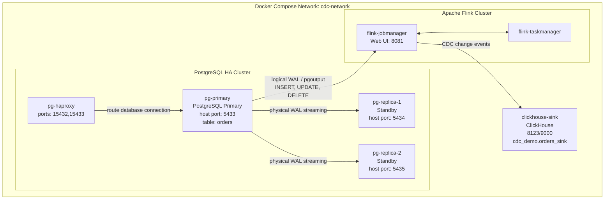

# 04. Kiến trúc hệ thống

> Phiên bản v1 đã chốt: chỉ dùng bảng `orders`; DELETE xử lý theo soft delete bằng `deleted`; ClickHouse lưu trạng thái mới nhất theo `order_id`; mục tiêu latency dưới 10 giây; tài liệu vừa để triển khai vừa để viết báo cáo.

## Thành phần chính

| Thành phần | Vai trò |
|---|---|
| `pg-primary` | PostgreSQL primary, nhận ghi dữ liệu |
| `pg-replica-1`, `pg-replica-2` | Standby replicas, nhận WAL từ primary |
| `pg-haproxy` | Proxy mô phỏng lớp truy cập PostgreSQL |
| `flink-jobmanager` | Điều phối Flink job |
| `flink-taskmanager` | Thực thi CDC task |
| `clickhouse-sink` | OLAP sink lưu `orders_sink` |
| `cdc-network` | Docker network cho các container |

## Sơ đồ Mermaid

## Luồng dữ liệu

1. Dữ liệu đơn hàng được ghi vào `pg-primary.orders`.
2. PostgreSQL ghi thay đổi vào WAL.
3. Hai replica nhận physical WAL streaming từ primary.
4. Flink CDC đọc logical WAL trên primary thông qua publication/slot.
5. Flink ghi event sang ClickHouse.
6. ClickHouse phục vụ truy vấn phân tích.

## Lưu ý kiến trúc

- Flink CDC đọc từ `pg-primary`, không đọc từ replica.
- HAProxy mô phỏng proxy database, không thay thế cơ chế CDC.
- Trong Docker network, các container gọi nhau bằng tên service/container, ví dụ `pg-primary:5432`, `clickhouse-sink:8123`.
