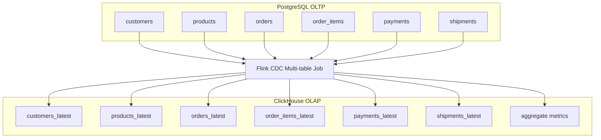

# 16. Mở rộng Multi-table CDC

## 1. Mục tiêu

V1 chỉ dùng bảng `orders`. Bản mở rộng production-like nên chuyển sang **multi-table CDC** để mô phỏng nghiệp vụ e-commerce sát thực tế hơn.

Mục tiêu:

- Mở rộng từ một bảng sang nhiều bảng có quan hệ nghiệp vụ.
- Hỗ trợ phân tích doanh thu, sản phẩm, khách hàng, thanh toán và giao hàng.
- Chuẩn bị cho dashboard OLAP và event-time metrics.

## 2. Vì sao cần multi-table CDC?

Trong thực tế, một đơn hàng không chỉ là một dòng trong bảng `orders`. Nó liên quan tới khách hàng, sản phẩm, chi tiết đơn, thanh toán, vận chuyển và lịch sử trạng thái. Multi-table CDC giúp dự án thể hiện được các vấn đề gần production:

- Nhiều bảng cùng thay đổi.
- Join dữ liệu phục vụ phân tích.
- Khóa ngoại và tính đầy đủ dữ liệu.
- Order event giữa các bảng.
- Kiểm tra correctness phức tạp hơn.

## 3. Schema mở rộng đề xuất

### `customers`

```sql
CREATE TABLE customers (
    customer_id BIGINT PRIMARY KEY,
    full_name TEXT NOT NULL,
    email TEXT,
    phone TEXT,
    city TEXT,
    created_at TIMESTAMP DEFAULT CURRENT_TIMESTAMP,
    updated_at TIMESTAMP DEFAULT CURRENT_TIMESTAMP,
    deleted BOOLEAN DEFAULT FALSE
);
```

### `products`

```sql
CREATE TABLE products (
    product_id BIGINT PRIMARY KEY,
    product_name TEXT NOT NULL,
    category TEXT,
    price NUMERIC(12,2),
    created_at TIMESTAMP DEFAULT CURRENT_TIMESTAMP,
    updated_at TIMESTAMP DEFAULT CURRENT_TIMESTAMP,
    deleted BOOLEAN DEFAULT FALSE
);
```

### `orders`

```sql
CREATE TABLE orders (
    order_id BIGINT PRIMARY KEY,
    customer_id BIGINT NOT NULL,
    status TEXT NOT NULL,
    amount NUMERIC(12,2) NOT NULL,
    created_at TIMESTAMP DEFAULT CURRENT_TIMESTAMP,
    updated_at TIMESTAMP DEFAULT CURRENT_TIMESTAMP,
    deleted BOOLEAN DEFAULT FALSE
);
```

### `order_items`

```sql
CREATE TABLE order_items (
    order_item_id BIGINT PRIMARY KEY,
    order_id BIGINT NOT NULL,
    product_id BIGINT NOT NULL,
    quantity INT NOT NULL,
    unit_price NUMERIC(12,2) NOT NULL,
    total_price NUMERIC(12,2) NOT NULL,
    created_at TIMESTAMP DEFAULT CURRENT_TIMESTAMP,
    updated_at TIMESTAMP DEFAULT CURRENT_TIMESTAMP,
    deleted BOOLEAN DEFAULT FALSE
);
```

### `payments`

```sql
CREATE TABLE payments (
    payment_id BIGINT PRIMARY KEY,
    order_id BIGINT NOT NULL,
    payment_method TEXT,
    payment_status TEXT NOT NULL,
    amount NUMERIC(12,2) NOT NULL,
    paid_at TIMESTAMP,
    created_at TIMESTAMP DEFAULT CURRENT_TIMESTAMP,
    updated_at TIMESTAMP DEFAULT CURRENT_TIMESTAMP,
    deleted BOOLEAN DEFAULT FALSE
);
```

### `shipments`

```sql
CREATE TABLE shipments (
    shipment_id BIGINT PRIMARY KEY,
    order_id BIGINT NOT NULL,
    shipping_status TEXT NOT NULL,
    carrier TEXT,
    shipped_at TIMESTAMP,
    delivered_at TIMESTAMP,
    created_at TIMESTAMP DEFAULT CURRENT_TIMESTAMP,
    updated_at TIMESTAMP DEFAULT CURRENT_TIMESTAMP,
    deleted BOOLEAN DEFAULT FALSE
);
```

## 4. Publication mở rộng

```sql
DROP PUBLICATION IF EXISTS ecommerce_pub;
CREATE PUBLICATION ecommerce_pub FOR TABLE
    customers,
    products,
    orders,
    order_items,
    payments,
    shipments;
```

Nên cấu hình:

```sql
ALTER TABLE customers REPLICA IDENTITY FULL;
ALTER TABLE products REPLICA IDENTITY FULL;
ALTER TABLE orders REPLICA IDENTITY FULL;
ALTER TABLE order_items REPLICA IDENTITY FULL;
ALTER TABLE payments REPLICA IDENTITY FULL;
ALTER TABLE shipments REPLICA IDENTITY FULL;
```

## 5. Bảng ClickHouse mở rộng

Có thể tách thành 3 nhóm:

| Nhóm | Ví dụ bảng | Vai trò |
|---|---|---|
| Latest state | `orders_latest`, `customers_latest` | Trạng thái mới nhất |
| History | `orders_history`, `payments_history` | Lưu lịch sử event |
| Aggregate | `revenue_by_minute`, `product_sales_daily` | Phục vụ dashboard |

Ví dụ latest state:

```sql
CREATE TABLE orders_latest (
    order_id Int64,
    customer_id Int64,
    status String,
    amount Decimal(12,2),
    created_at DateTime,
    updated_at DateTime,
    deleted UInt8
)
ENGINE = ReplacingMergeTree(updated_at)
ORDER BY order_id;
```

## 6. Luồng nghiệp vụ mô phỏng

```text
1. INSERT customer
2. INSERT products
3. INSERT orders status = CREATED
4. INSERT order_items
5. INSERT payments status = PENDING
6. UPDATE payments status = SUCCESS
7. UPDATE orders status = PAID
8. INSERT shipments status = CREATED
9. UPDATE shipments status = DELIVERING
10. UPDATE orders status = SHIPPED
11. UPDATE shipments status = DELIVERED
12. UPDATE orders status = COMPLETED
```

## 7. Sơ đồ



## 8. Khuyến nghị triển khai

- Trong v1: chỉ giữ `orders` để chắc chắn pipeline chạy đúng.
- Nếu còn thời gian: thêm `customers`, `products`, `order_items`.
- Trong future work: thêm `payments`, `shipments`, bảng history và realtime metrics.

## 9. Checklist

- [ ] Có schema nhiều bảng.
- [ ] Có publication nhiều bảng.
- [ ] Có `REPLICA IDENTITY FULL`.
- [ ] Có ClickHouse latest table.
- [ ] Có mô tả multi-table CDC trong báo cáo.
- [ ] Có sơ đồ mở rộng.

## 10. Đoạn viết báo cáo

Trong bản mở rộng, hệ thống có thể phát triển từ CDC một bảng `orders` sang mô hình multi-table CDC cho toàn bộ nghiệp vụ đơn hàng thương mại điện tử. Các bảng như `customers`, `products`, `order_items`, `payments` và `shipments` được đồng bộ từ PostgreSQL sang ClickHouse thông qua Flink CDC. Cách mở rộng này giúp pipeline phản ánh sát hơn bài toán thực tế, trong đó dữ liệu phân tích cần kết hợp nhiều nguồn nghiệp vụ để tính doanh thu, số lượng sản phẩm bán ra, trạng thái thanh toán và hiệu quả vận chuyển.
