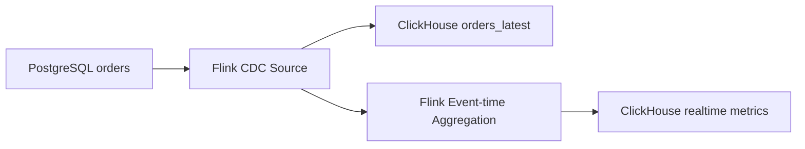

# 17. Xử lý streaming theo event-time với Apache Flink

## 1. Mục tiêu

Đề tài yêu cầu có kiến trúc xử lý streaming theo event-time. V1 đồng bộ latest state; bản mở rộng bổ sung event-time để tính realtime metrics như doanh thu theo phút, số đơn theo trạng thái, tỷ lệ hủy đơn.

## 2. Event-time là gì?

| Loại thời gian | Ý nghĩa |
|---|---|
| Event-time | Thời điểm sự kiện thật sự xảy ra trong nghiệp vụ |
| Processing-time | Thời điểm Flink xử lý event |
| Ingestion-time | Thời điểm event đi vào pipeline |

Ví dụ: đơn tạo lúc 10:00:00, Flink nhận lúc 10:00:04. Nếu tính doanh thu theo phút thì nên dùng 10:00:00, không phải 10:00:04.

## 3. Chọn event-time cho dự án

Với bảng `orders`, chọn:

```text
updated_at
```

Lý do:

- Mỗi thay đổi `INSERT/UPDATE/SOFT DELETE` đều cập nhật `updated_at`.
- Có thể dùng làm version trong ClickHouse.
- Phù hợp để tính trạng thái và metric theo thời gian cập nhật.

Nếu mở rộng bảng `payments`, có thể dùng `paid_at` cho doanh thu.

## 4. Watermark

Watermark giúp Flink xử lý dữ liệu đến muộn. Đề xuất cho lab:

```text
Watermark delay = 10 giây
```

Không đặt quá thấp vì Docker local có thể trễ; không đặt quá cao vì làm chậm kết quả realtime.

## 5. Metric mở rộng

| Metric | Window | Sink table |
|---|---|---|
| Số đơn mới | 1 phút | `orders_count_1m` |
| Doanh thu | 1 phút | `revenue_by_minute` |
| Số đơn theo trạng thái | 1 phút | `order_status_by_minute` |
| Số đơn hủy | 5 phút | `cancelled_orders_5m` |

## 6. ClickHouse table cho metric

```sql
CREATE TABLE revenue_by_minute (
    window_start DateTime,
    window_end DateTime,
    total_orders UInt64,
    total_revenue Decimal(18,2),
    updated_at DateTime
)
ENGINE = ReplacingMergeTree(updated_at)
ORDER BY window_start;
```

```sql
CREATE TABLE order_status_by_minute (
    window_start DateTime,
    window_end DateTime,
    status String,
    total_orders UInt64,
    updated_at DateTime
)
ENGINE = ReplacingMergeTree(updated_at)
ORDER BY (window_start, status);
```

## 7. Flink SQL minh họa

```sql
CREATE TABLE orders_source (
    order_id BIGINT,
    customer_id BIGINT,
    status STRING,
    amount DECIMAL(12,2),
    created_at TIMESTAMP(3),
    updated_at TIMESTAMP(3),
    deleted BOOLEAN,
    WATERMARK FOR updated_at AS updated_at - INTERVAL '10' SECOND,
    PRIMARY KEY (order_id) NOT ENFORCED
) WITH (
    'connector' = 'postgres-cdc',
    'hostname' = 'pg-primary',
    'port' = '5432',
    'username' = 'postgres',
    'password' = 'postgres',
    'database-name' = 'cdc_demo',
    'schema-name' = 'public',
    'table-name' = 'orders',
    'slot.name' = 'flink_orders_slot_event_time'
);
```

Aggregation minh họa:

```sql
INSERT INTO revenue_by_minute_sink
SELECT
    window_start,
    window_end,
    COUNT(*) AS total_orders,
    SUM(amount) AS total_revenue,
    CURRENT_TIMESTAMP AS updated_at
FROM TABLE(
    TUMBLE(TABLE orders_source, DESCRIPTOR(updated_at), INTERVAL '1' MINUTE)
)
WHERE deleted = FALSE AND status IN ('PAID', 'COMPLETED')
GROUP BY window_start, window_end;
```

## 8. Lưu ý với CDC update/delete

Event-time aggregation trên CDC update/delete phức tạp hơn insert-only stream. Ví dụ một đơn chuyển `CREATED → PAID`, nếu không thiết kế cẩn thận có thể tính doanh thu hai lần. Vì vậy:

- V1: lưu latest state.
- Mở rộng: tính metrics từ trạng thái đã chuẩn hóa hoặc dùng changelog đúng semantics.

## 9. Sơ đồ



## 10. Checklist

- [ ] Chọn `updated_at` làm event-time.
- [ ] Có watermark.
- [ ] Có bảng metric trong ClickHouse.
- [ ] Có query window aggregation.
- [ ] Có test dữ liệu đến muộn.
- [ ] Có ghi rõ hạn chế với update/delete.

## 11. Đoạn viết báo cáo

Trong bản mở rộng, Flink không chỉ đồng bộ dữ liệu CDC mà còn có thể xử lý streaming theo event-time. Cột `updated_at` được sử dụng làm event-time, kết hợp watermark để xử lý dữ liệu đến muộn. Trên cơ sở đó, hệ thống có thể tính các chỉ số gần thời gian thực như doanh thu theo phút, số đơn theo trạng thái và số đơn bị hủy. Kết quả aggregation được ghi sang ClickHouse để phục vụ dashboard phân tích.
