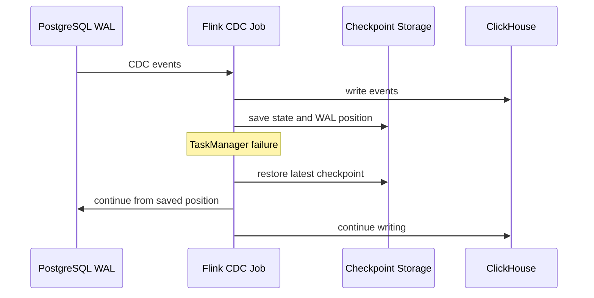

# 19. Checkpoint, Savepoint và HA cho luồng CDC

## 1. Mục tiêu

Checkpoint và savepoint là hai cơ chế quan trọng giúp Flink CDC pipeline có khả năng phục hồi và nâng cấp an toàn.

Phần này trả lời:

- Checkpoint dùng để làm gì trong CDC?
- Savepoint khác checkpoint như thế nào?
- Làm sao test fault tolerance?
- Nên viết gì trong báo cáo để không khẳng định quá mức?

## 2. Checkpoint là gì?

Checkpoint là trạng thái được Flink tự động lưu định kỳ. Với CDC job, checkpoint có thể lưu:

- Vị trí đọc WAL/offset.
- State của operator.
- Metadata phục hồi.
- Trạng thái xử lý liên quan đến sink.

Khi TaskManager lỗi, Flink có thể khôi phục job từ checkpoint gần nhất.

## 3. Savepoint là gì?

Savepoint là snapshot trạng thái được tạo thủ công, dùng khi:

- Dừng job có kiểm soát.
- Nâng cấp job.
- Thay connector/version.
- Di chuyển job sang môi trường khác.
- Rollback khi deploy lỗi.

| Tiêu chí | Checkpoint | Savepoint |
|---|---|---|
| Tạo | Tự động | Thủ công |
| Mục tiêu | Fault tolerance | Upgrade/maintenance |
| Quản lý | Flink | Người vận hành |
| Dùng khi | Job lỗi/restart | Dừng/nâng cấp job |

## 4. Cấu hình checkpoint đề xuất

Docker Compose truyền cùng cấu hình sau vào cả JobManager và TaskManager qua
`FLINK_PROPERTIES`:

```yaml
restart-strategy.type: fixed-delay
restart-strategy.fixed-delay.attempts: 3
restart-strategy.fixed-delay.delay: 10 s
state.backend.type: hashmap
state.checkpoints.dir: file:///opt/flink/checkpoints
execution.checkpointing.interval: 10 s
execution.checkpointing.mode: EXACTLY_ONCE
execution.checkpointing.timeout: 60 s
execution.checkpointing.max-concurrent-checkpoints: 1
```

Thư mục `/opt/flink/checkpoints` được mount bằng named volume
`flink_checkpoints` trên cả hai container. Cấu hình này bảo đảm Flink có state
để phục hồi khi TaskManager bị restart. Nó không đồng nghĩa với HA cho
JobManager và không tự động chứng minh exactly-once end-to-end của ClickHouse
sink.

Trong dự án có volume:

```yaml
flink_checkpoints:/opt/flink/checkpoints
```

Cấu hình tham khảo trong `flink-conf.yaml`:

```yaml
state.backend: filesystem
state.checkpoints.dir: file:///opt/flink/checkpoints
execution.checkpointing.interval: 10000
execution.checkpointing.mode: EXACTLY_ONCE
execution.checkpointing.timeout: 60000
execution.checkpointing.min-pause: 5000
execution.checkpointing.tolerable-failed-checkpoints: 3
```

## 5. Cách nói đúng về exactly-once

Nên viết:

```text
Flink checkpoint giúp job khôi phục trạng thái và vị trí đọc sau lỗi. Với ClickHouse sink, hệ thống kết hợp checkpoint với thiết kế idempotent để đảm bảo kết quả cuối cùng nhất quán.
```

Không nên khẳng định tuyệt đối nếu chưa chứng minh sink transaction:

```text
Pipeline đảm bảo exactly-once end-to-end tuyệt đối.
```

## 6. Test checkpoint/fault tolerance

### Bước 1: Kiểm tra job chạy

```powershell
docker exec -it flink-jobmanager /opt/flink/bin/flink list
```

### Bước 2: Insert dữ liệu trước restart

```sql
INSERT INTO orders(order_id, customer_id, status, amount, deleted)
VALUES (800001, 101, 'CREATED', 100000, FALSE);
```

### Bước 3: Kiểm tra ClickHouse

```sql
SELECT * FROM ecommerce_ods.orders_sink FINAL WHERE order_id = 800001;
```

### Bước 4: Restart TaskManager

```powershell
docker restart flink-taskmanager
```

### Bước 5: Insert dữ liệu sau restart

```sql
INSERT INTO orders(order_id, customer_id, status, amount, deleted)
VALUES (800002, 102, 'CREATED', 200000, FALSE);
```

### Bước 6: Kiểm tra ClickHouse

```sql
SELECT *
FROM ecommerce_ods.orders_sink FINAL
WHERE order_id IN (800001, 800002);
```

Kỳ vọng:

- Dữ liệu trước restart vẫn có.
- Dữ liệu sau restart vẫn được đồng bộ.
- Job tiếp tục RUNNING.

## 7. Savepoint demo/hướng mở rộng

Lấy job id:

```powershell
docker exec -it flink-jobmanager /opt/flink/bin/flink list
```

Trigger savepoint:

```powershell
docker exec -it flink-jobmanager /opt/flink/bin/flink savepoint <JOB_ID> file:///opt/flink/checkpoints/savepoints
```

Stop with savepoint:

```powershell
docker exec -it flink-jobmanager /opt/flink/bin/flink stop --savepointPath file:///opt/flink/checkpoints/savepoints <JOB_ID>
```

Nếu job đang chạy bằng SQL Client, restore từ savepoint có thể cần đóng gói thành Flink application job. Trong báo cáo có thể trình bày savepoint là hướng vận hành khi pipeline được đóng gói production.

## 8. Lỗi thường gặp

| Lỗi | Nguyên nhân | Cách xử lý |
|---|---|---|
| Không có checkpoint | Chưa bật checkpoint hoặc sai path | Kiểm tra `flink-conf.yaml` |
| Checkpoint fail | Sink chậm, timeout thấp | Tăng timeout, kiểm tra ClickHouse |
| Restart đọc lại từ đầu | Không restore checkpoint hoặc đổi slot | Giữ slot name và checkpoint |
| Savepoint không restore | Job không tương thích | Giữ uid/schema ổn định |

## 9. Sơ đồ



## 10. Checklist

- [ ] Có checkpoint volume.
- [ ] Có cấu hình checkpoint.
- [ ] Có test restart TaskManager.
- [ ] Có dữ liệu trước/sau restart.
- [ ] Có ảnh Flink UI.
- [ ] Có giải thích checkpoint vs savepoint.
- [ ] Có giải thích giới hạn exactly-once end-to-end.

## 11. Đoạn viết báo cáo

Apache Flink cung cấp checkpoint để lưu trạng thái xử lý định kỳ, giúp CDC job khôi phục vị trí đọc WAL sau khi xảy ra lỗi. Trong dự án, checkpoint được lưu vào volume riêng để tránh mất trạng thái khi container khởi động lại. Savepoint được sử dụng như một cơ chế snapshot thủ công phục vụ dừng job có kiểm soát và nâng cấp pipeline. Trong phạm vi thực nghiệm, khả năng fault tolerance được kiểm chứng bằng cách restart Flink TaskManager và xác minh dữ liệu vẫn tiếp tục được đồng bộ sang ClickHouse.
