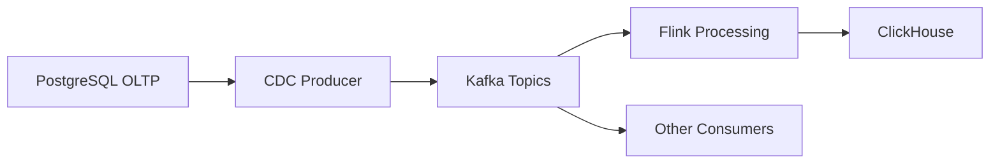

# 22. Hướng mở rộng với Kafka

## 1. Mục tiêu

V1 dùng kiến trúc trực tiếp:

```text
PostgreSQL → Flink CDC → ClickHouse
```

Production mở rộng có thể thêm Kafka:

```text
PostgreSQL → Flink CDC/Debezium → Kafka → Flink Processing → ClickHouse
```

## 2. Vì sao thêm Kafka?

Kafka đóng vai trò event buffer/event log trung gian.

Lợi ích:

- Buffer khi sink chậm.
- Nhiều consumer cùng đọc CDC.
- Replay event.
- Tách source và sink.
- Hỗ trợ kiến trúc event-driven.
- Giảm coupling giữa CDC ingestion và OLAP serving.

## 3. Khi nào chưa cần Kafka?

Với bài hiện tại:

- Một source.
- Một sink chính.
- Chạy local Docker Compose.
- Mục tiêu là chứng minh CDC end-to-end.

=> Chưa cần Kafka trong v1 để tránh tăng độ phức tạp.

## 4. Kiến trúc có Kafka



Topic đề xuất:

| Bảng | Topic | Key |
|---|---|---|
| `orders` | `cdc.public.orders` | `order_id` |
| `customers` | `cdc.public.customers` | `customer_id` |
| `products` | `cdc.public.products` | `product_id` |
| `payments` | `cdc.public.payments` | `payment_id` |

## 5. Hai hướng triển khai

### Hướng A: Flink CDC ghi Kafka

```text
PostgreSQL → Flink CDC → Kafka → Flink → ClickHouse
```

Phù hợp nếu muốn dùng Flink xuyên suốt.

### Hướng B: Debezium ghi Kafka

```text
PostgreSQL → Debezium → Kafka → Flink → ClickHouse
```

Phù hợp production vì Debezium rất phổ biến cho CDC qua Kafka.

## 6. Trade-off

| Tiêu chí | Direct CDC | Có Kafka |
|---|---|---|
| Độ phức tạp | Thấp | Cao |
| Dễ demo | Cao | Trung bình |
| Replay | Hạn chế | Tốt |
| Nhiều consumer | Khó | Tốt |
| Buffer khi sink lỗi | Hạn chế | Tốt |
| Phù hợp v1 | Rất phù hợp | Chưa cần |
| Phù hợp production | Trung bình | Cao |

## 7. Vấn đề cần thiết kế khi có Kafka

- Message format: JSON, Avro, Debezium envelope.
- Topic retention.
- Partition key.
- Consumer group.
- Schema Registry.
- Dead-letter topic.
- Replay policy.
- Monitoring Kafka lag.

## 8. Checklist

- [ ] Có lý do chưa dùng Kafka ở v1.
- [ ] Có kiến trúc Kafka mở rộng.
- [ ] Có topic design.
- [ ] Có trade-off.
- [ ] Có đưa vào future work.

## 9. Đoạn viết báo cáo

Trong phạm vi v1, hệ thống sử dụng kiến trúc trực tiếp PostgreSQL → Flink CDC → ClickHouse để giảm độ phức tạp và phù hợp môi trường thực nghiệm. Trong hướng mở rộng production, Kafka có thể được bổ sung làm tầng event buffer trung gian. CDC event từ PostgreSQL được ghi vào các Kafka topic theo từng bảng, sau đó Flink đọc từ Kafka để xử lý và ghi sang ClickHouse. Cách tiếp cận này hỗ trợ replay event, nhiều consumer và tăng khả năng chịu lỗi khi downstream gặp sự cố.
