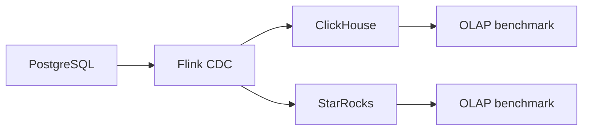

# 23. So sánh ClickHouse và StarRocks cho OLAP Sink

## 1. Mục tiêu

Đề bài cho phép target là StarRocks hoặc ClickHouse. V1 chọn ClickHouse. Phần này giải thích lựa chọn và đưa StarRocks vào hướng mở rộng.

## 2. Vai trò OLAP sink

OLAP sink dùng để:

- Lưu dữ liệu đã đồng bộ từ PostgreSQL.
- Phục vụ truy vấn tổng hợp nhanh.
- Tách tải phân tích khỏi OLTP.
- Phục vụ dashboard và báo cáo vận hành.

## 3. Vì sao chọn ClickHouse cho v1?

ClickHouse phù hợp vì:

- Dễ chạy bằng Docker.
- Nhẹ hơn để demo local.
- Truy vấn OLAP nhanh.
- Lưu trữ theo cột.
- Hỗ trợ SQL tốt.
- Có `ReplacingMergeTree` để lưu latest state.
- Phù hợp với mục tiêu đồng bộ `orders` và đo kiểm.

Điểm cần chú ý:

- Update/delete không giống OLTP.
- Cần soft delete và version.
- Query latest state nên dùng `FINAL` khi kiểm chứng.

## 4. StarRocks phù hợp khi nào?

StarRocks phù hợp khi:

- Cần real-time analytics với update/delete thường xuyên.
- Cần primary key/upsert model rõ hơn.
- Cần dashboard với nhiều truy vấn đồng thời.
- Có hạ tầng nhiều tài nguyên hơn.
- Muốn so sánh các OLAP engine.

Nhược điểm trong lab:

- Cấu hình phức tạp hơn.
- Nặng hơn ClickHouse.
- Dễ làm tăng rủi ro deadline.

## 5. Bảng so sánh

| Tiêu chí | ClickHouse | StarRocks |
|---|---|---|
| Loại hệ thống | Column-oriented OLAP DBMS | MPP OLAP database |
| Triển khai local | Dễ hơn | Phức tạp hơn |
| Truy vấn tổng hợp | Rất mạnh | Rất mạnh |
| Update/delete | Cần thiết kế kỹ | Primary key model thuận lợi hơn |
| Sink CDC | Làm được qua connector/JDBC | Làm được qua connector/stream load |
| Tài nguyên local | Nhẹ hơn | Nặng hơn |
| Phù hợp v1 | Rất cao | Trung bình |
| Phù hợp future work | Cao | Cao |

## 6. Kiến trúc so sánh mở rộng



## 7. Benchmark đề xuất

Dùng cùng dữ liệu `orders` với các mức:

```text
10k rows
50k rows
100k rows
```

Truy vấn benchmark:

```sql
SELECT status, COUNT(*)
FROM orders_latest
WHERE deleted = 0
GROUP BY status;
```

```sql
SELECT toDate(created_at), SUM(amount)
FROM orders_latest
WHERE deleted = 0
GROUP BY toDate(created_at)
ORDER BY toDate(created_at);
```

```sql
SELECT customer_id, SUM(amount)
FROM orders_latest
WHERE deleted = 0
GROUP BY customer_id
ORDER BY SUM(amount) DESC
LIMIT 10;
```

## 8. Metrics so sánh

| Metric | Ý nghĩa |
|---|---|
| Insert latency | Thời gian ghi từ Flink vào sink |
| Query latency | Thời gian chạy truy vấn OLAP |
| Storage size | Dung lượng lưu trữ |
| Update correctness | Kết quả sau update |
| Delete correctness | Kết quả sau soft/hard delete |
| Operational complexity | Độ khó triển khai/vận hành |

## 9. Khuyến nghị

- V1: chọn ClickHouse.
- Future work: thêm StarRocks để so sánh.
- Không nên triển khai StarRocks ngay nếu thời gian hạn chế.

## 10. Đoạn viết báo cáo

Dự án lựa chọn ClickHouse làm OLAP sink chính do khả năng truy vấn phân tích nhanh, triển khai đơn giản bằng Docker và phù hợp với phạm vi thực nghiệm. ClickHouse sử dụng mô hình lưu trữ theo cột và engine `ReplacingMergeTree` để hỗ trợ lưu trạng thái mới nhất của dữ liệu CDC. StarRocks được xem là hướng mở rộng tiềm năng, đặc biệt trong các bài toán real-time analytics có nhu cầu upsert/update mạnh hơn. Trong tương lai, hệ thống có thể bổ sung StarRocks làm sink thứ hai để so sánh hiệu năng ghi, độ trễ truy vấn và độ phức tạp vận hành.
