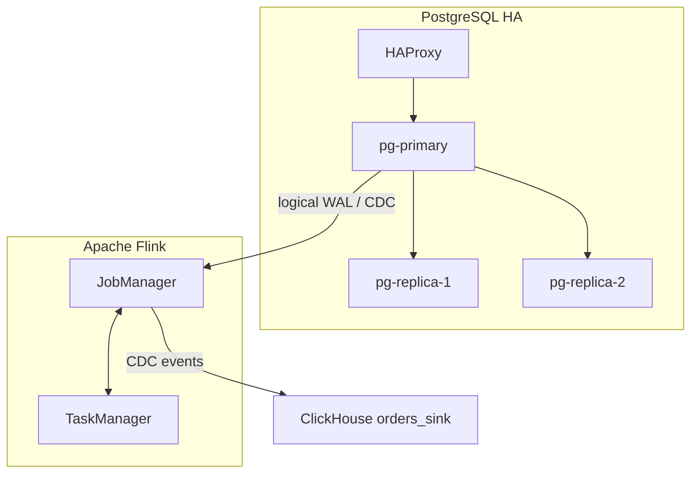

# 29. Cấu trúc báo cáo hoàn chỉnh

## 1. Mục tiêu

Báo cáo cần thể hiện ba lớp:

```text
Lý thuyết đúng → Triển khai chạy được → Đo kiểm có kết quả
```

Đề tài:

```text
Xây dựng luồng CDC đồng bộ và xử lý dữ liệu từ OLTP sang OLAP database với Flink CDC
```

## 2. Cấu trúc đề xuất

```text
1. Giới thiệu
2. Cơ sở lý thuyết
3. Bài toán và yêu cầu hệ thống
4. Thiết kế kiến trúc
5. Thiết kế dữ liệu
6. Triển khai hệ thống
7. Kiểm thử và đánh giá
8. Production readiness và hướng mở rộng
9. Kết luận
10. Tài liệu tham khảo
```

## 3. Chương 1 — Giới thiệu

Nội dung:

- Dữ liệu giao dịch phát sinh liên tục.
- PostgreSQL phù hợp OLTP nhưng không tối ưu cho OLAP nặng.
- Cần tách phân tích sang ClickHouse.
- CDC giúp đồng bộ gần real-time.
- Flink CDC là engine đọc thay đổi và xử lý streaming.

Đoạn mẫu:

```text
Trong các hệ thống giao dịch hiện đại, dữ liệu phát sinh liên tục từ các thao tác như tạo đơn hàng, cập nhật trạng thái thanh toán, giao hàng hoặc hủy đơn. PostgreSQL phù hợp cho xử lý giao dịch OLTP nhờ khả năng đảm bảo tính nhất quán và độ trễ thấp. Tuy nhiên, các truy vấn phân tích tổng hợp trên khối lượng dữ liệu lớn có thể gây tải đáng kể lên hệ thống giao dịch. Do đó, đề tài xây dựng pipeline CDC đồng bộ dữ liệu từ PostgreSQL sang ClickHouse bằng Apache Flink CDC theo thời gian gần thực.
```

## 4. Chương 2 — Cơ sở lý thuyết

Các khái niệm cần có:

- OLTP và OLAP.
- CDC.
- WAL.
- Physical replication.
- Logical replication.
- Publication và replication slot.
- Flink CDC.
- Checkpoint và savepoint.
- ClickHouse column-store.
- Idempotent và ordering.
- Event-time.

Mỗi khái niệm nên trả lời:

```text
Là gì?
Dùng ở đâu trong dự án?
Vì sao quan trọng?
```

## 5. Chương 3 — Bài toán và yêu cầu

Bài toán đã chốt:

```text
Đồng bộ dữ liệu đơn hàng thương mại điện tử từ PostgreSQL OLTP sang ClickHouse OLAP.
```

Yêu cầu:

- PostgreSQL 1 primary + 2 replica.
- Flink CDC đọc `INSERT/UPDATE/DELETE`.
- ClickHouse nhận dữ liệu.
- Latency mục tiêu dưới 10 giây.
- Có checkpoint/fault tolerance cơ bản.
- Có idempotent sink.

## 6. Chương 4 — Kiến trúc

Cần có sơ đồ:



## 7. Chương 5 — Thiết kế dữ liệu

Source `orders`:

```text
order_id, customer_id, status, amount, created_at, updated_at, deleted
```

Sink:

```text
orders_sink
ReplacingMergeTree(updated_at)
ORDER BY order_id
```

Giải thích:

- `order_id`: khóa nghiệp vụ.
- `updated_at`: version/event-time.
- `deleted`: soft delete.

## 8. Chương 6 — Triển khai

Nội dung:

- Docker Compose.
- PostgreSQL primary/replica.
- Flink Dockerfile và connectors.
- ClickHouse init.
- HAProxy.
- Lệnh chạy và kiểm tra.

Ảnh nên có:

- `docker ps`.
- Flink UI.
- `pg_stat_replication`.
- `pg_replication_slots`.
- ClickHouse query.

## 9. Chương 7 — Kiểm thử và đánh giá

Bốn nhóm đo:

| Nhóm | Cách đo |
|---|---|
| Latency | Postgres write → ClickHouse visible |
| Throughput | rows/s |
| Correctness | count/sum/status |
| Fault tolerance | restart TaskManager |

Bảng mẫu:

| Test | Kỳ vọng | Kết quả | Đánh giá |
|---|---|---|---|
| Primary | `pg_is_in_recovery=f` | Điền | Pass/Fail |
| Replica | `pg_is_in_recovery=t` | Điền | Pass/Fail |
| INSERT | CH có dòng mới | Điền | Pass/Fail |
| UPDATE | CH cập nhật status | Điền | Pass/Fail |
| SOFT DELETE | `deleted=1` | Điền | Pass/Fail |
| Latency | < 10s | Điền | Pass/Fail |

## 10. Chương 8 — Production readiness

Đã có:

- PostgreSQL HA.
- Flink CDC.
- Checkpoint volume.
- Idempotent sink.
- Soft delete.
- Fault tolerance test.
- Runbook/monitoring cơ bản.

Còn thiếu:

- Prometheus/Grafana.
- Kafka.
- Security hardening.
- Schema evolution.
- Kubernetes.

## 11. Chương 9 — Kết luận

Đoạn mẫu:

```text
Đề tài đã xây dựng pipeline CDC đồng bộ dữ liệu đơn hàng từ PostgreSQL sang ClickHouse bằng Apache Flink CDC. PostgreSQL được triển khai theo mô hình primary-replica để mô phỏng nguồn dữ liệu có tính sẵn sàng cao. Flink CDC đọc thay đổi từ WAL của PostgreSQL và ghi dữ liệu sang ClickHouse phục vụ truy vấn phân tích. Hệ thống được kiểm thử qua các thao tác INSERT, UPDATE, soft delete và đánh giá theo latency, throughput, correctness, fault tolerance. Trong tương lai, hệ thống có thể mở rộng thêm multi-table CDC, Kafka, monitoring, schema evolution và StarRocks.
```

## 12. Checklist báo cáo

- [ ] Có bối cảnh và mục tiêu.
- [ ] Có cơ sở lý thuyết.
- [ ] Có kiến trúc.
- [ ] Có schema.
- [ ] Có triển khai.
- [ ] Có kiểm thử PostgreSQL HA.
- [ ] Có kiểm thử CDC.
- [ ] Có benchmark.
- [ ] Có production readiness.
- [ ] Có hướng mở rộng.
- [ ] Có kết luận.
